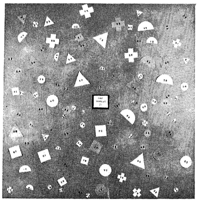
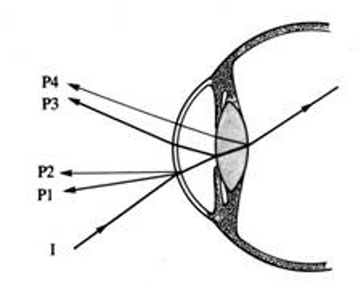

---

title       : The effect of target specification on objects fixated during visual search
subtitle    : A replication of L.G. Williams' 1967 study
author      : Ryan M. Hope
job         : CogWorks Lab
biglogo     : rpi_logo.png
logo        : cogworks_logo.png
framework   : io2012
highlighter : highlight.js
hitheme     : tomorrow
widgets     : []
mode        : selfcontained # {standalone, draft}
github      :
                author  : ryanhope
                repo    : issues_fall2012

--- &twocol  w1:48% w2:48%

```{r include=FALSE}
source("~/workspace/WilliamsTask/williams.R")
```

## The Williams' Search Task

*** left



*** right

```{r echo=FALSE, warning=FALSE, fig.width=6.15, fig.height=6.15}
plot_trial("~/williams-data/WilliamsSearch_2012-11-11_19-08-53_cbd946c2", 1, radii=F, fix.radius=F, samples=F)
```

---

## Motivation

> 1. ICCM 2010, Dave Kieras shows off improvements to Epic's visual system, uses Williams' search task for test model/data
> 2. CogWorks Lab got 2 awesome new high-speed eyetrackers
> 3. Inform work on lab grants:
>  - ONR Grant - Extreme Expertise in Cognitive Skill
>  - DARPA STTR SB12A-004 - Data Visualization

---

## Why the Williams' 1967 study needs replicating

> 1. Eyetracking technology has improved greatly
> 1. Computer algorithms for analyzing eyetracker data
> 1. Other methodological concerns

--- &twocol  w1:48% w2:48%

## Corneal Reflex Eye tracking

Purkinje images (reflections) are used in eye tracking technology to locate the orientation of the eye, by comparing the position of the first reflection of a known, fixed, infrared light source with the position of the pupil.

*** left

<video width="480" height="360" autoplay="autoplay" loop="loop">
  <source src="assets/video/raweye.mp4" type="video/mp4">
</video>

*** right



--- &twocol  w1:58% w2:38%

## The Williams' 1967 setup

*** left


*** right

- 1 image every 4 seconds
- each 4 second image contains multiple fixations
- left eye mostly occluded
- no temporal information
- ~1/6 trials not tabulated
- ~29% of tabulated fixations not classified
- search times approximated indirectly

--- &twocol  w1:58% w2:38%

## The CogWorks 2012 setup

*** left


*** right

- 1 sample every 2 milliseconds
- 3% trials dropped (>10% missing data)
- average 0.8% missing data per trial

--- &vcenter

## Classifying Raw Gaze Sample

```{r echo=FALSE, warning=FALSE, fig.width=13, fig.height=6.5, error=FALSE}
d=getData("~/williams-data/WilliamsSearch_2012-11-11_19-29-17_cbd946c2/trial-05.txt")
d.pva = pva(d$smi_sxl, d$smi_syl, d$adjusted_time, 500, 1680, 1050, 473.76, 296.1, d$smi_ezl, d$smi_exl, d$smi_eyl)
d.c <- classify.VA(as.data.frame(d.pva)$v, as.data.frame(d.pva)$a)
plot(d.pva, d.c) + theme(strip.text=element_text(face="bold", size=14),
                         legend.text=element_text(face="bold", size=14))

```

<div style="position:absolute; left:60px; bottom:28px; width:75%;">
Velocity Threshold = 30&deg;/s, Acceleration Threshold = 8000&deg;/s&sup2;
</div>

--- &vcenter

## Tabulating Fixations

```{r echo=FALSE, warning=FALSE, fig.width=13, fig.height=6.5, error=FALSE}
plot_trial("~/williams-data/WilliamsSearch_2012-11-11_19-29-17_cbd946c2", 5)
```

<div style="position:absolute; left:60px; bottom:28px; width:75%;">
Cue: Red, Crescent, Medium, 41
</div>

--- &twocol  w1:48% w2:48%

## Other experimental differences

*** left

### Williams 1967

- 5 shapes x 5 colors x 4 sizes
- shapes: semi circle, circle, triangle, cross, square
- sizes: 2.8, 1.9, 1.3, 0.8
- 800 unique cue combinations
- 30 subjects
- 200 trials per subject
- <5000 good trials?

*** right

### CogWorks 2012

- 4 shapes x 4 colors x 3 sizes
- shapes: crescent, star, cross, oval
- sizes: 1.87, 1.11, .44
- 384 unique cue combinations
- 16 subjects
- 384 trials per subject
- 5939 good trials
- randomized cue order

--- &vcenter

## Breakdowns: 1967 Study

Proportions of fixations (for fixations that landed on objects)

```{r echo=FALSE, warning=FALSE, error=FALSE, results='asis'}
print(xtable(breakdown.w67()),type="html")
```

--- &vcenter

## Breakdowns: 2012 Study

Proportions of fixations (for fixations that landed on objects)

```{r echo=FALSE, warning=FALSE, error=FALSE, results='asis'}
print(xtable(breakdown(read.table("~/williams-tabulated2-sup.dat",header=T))),type="html")
```

--- &vcenter

## Fixation Proportions

```{r echo=FALSE, warning=FALSE, fig.width=13, fig.height=6.5}
plot_agg2(read.table("~/w67.combined2.dat",header=T))
```

--- &vcenter

## Number of Fixations

```{r echo=FALSE, warning=FALSE, fig.width=13, fig.height=6.5}
plot_nfix2(read.table("~/times.dat",header=T))
```

--- &vcenter

## Fixations / Number of Objects

```{r echo=FALSE, warning=FALSE, fig.width=13, fig.height=6.5}
plot_avg_fix2(read.table("~/times.dat",header=T))
```

--- &vcenter

## Refixations

```{r echo=FALSE, warning=FALSE, fig.width=13, fig.height=6.5}
plot_trial("~/williams-data/WilliamsSearch_2012-11-11_19-29-17_cbd946c2", 3, radii=F, fix.radius=F)
```

--- &vcenter

## Backtracking

```{r echo=FALSE, warning=FALSE, fig.width=13, fig.height=6.5}
plot_trial("~/williams-data/WilliamsSearch_2012-11-11_19-08-53_cbd946c2", 8, radii=F, fix.radius=T)
```

<div style="position:absolute; left:60px; bottom:28px; width:75%;">
Cue: Cross, 05
</div>

--- &twocol  w1:48% w2:48%

## Fixation Durations

*** left

```{r echo=FALSE, warning=FALSE, fig.width=6.5, fig.height=6.5}
plot_fixdur()
```

*** right

```{r echo=FALSE, warning=FALSE, fig.width=6.5, fig.height=6.5}
plot_fixdur_hist()
```

<div style="position:absolute; left:60px; bottom:28px; width:75%;">
Error bars are 95% confidence intervals
</div>

---

## What Williams found ~50 years ago

- When a person searches for a target in cluttered a visual field, fixations typically fall on objects
- When the search field contains object differing widely in size, color and shape:
 * A high proportion of fixations were on objects of specified color
 * A moderate proportion of fixations were on objects of specified size or shape
 * When two or more target characteristics are specified, fixations were generally based on a single characteristic

---

## What is new in 2012 (so far)

- Size can be a better cue than color
- Refixations are highly prevalent when cue is not useful
- Not all visual processing happens during fixations
 - implications for cognitive architectures

--- &vcenter

## Application: Data Visualization


---

## Whats to come?

- Collect data from more subjects in Q1 2013
- Analyze in more detail "backtracking"
- Test Williams' search time predictions
- ACT-R model

---

## References

- Dodge, R., & Cline, T. (1901). The angle velocity of eye movements. Psychological Review.
- Williams, L. G. (1966). A study of visual search using eye movement recordings.
- Williams, L. G. (1967). The effects of target specification on objects fixated during visual search. Acta Psychologica, 27(00), 355–360.
- Williams, L. G. (1968). A study of visual search using eye movement recordings: Validation Studies.
- Kieras, D. (2010). Modeling Visual Search of Displays of Many Objects : The Role of Differential Acuity and Fixation Memory. In D. D. Salvucci & G. Gunzelmann (Eds.), Proceedings of the 10th international conference on cognitive modeling. Philadelphia, PA: Drexel University.
- Nyström, M., & Holmqvist, K. (2010). An adaptive algorithm for fixation, saccade, and glissade detection in eyetracking data. Behavior Research Methods.