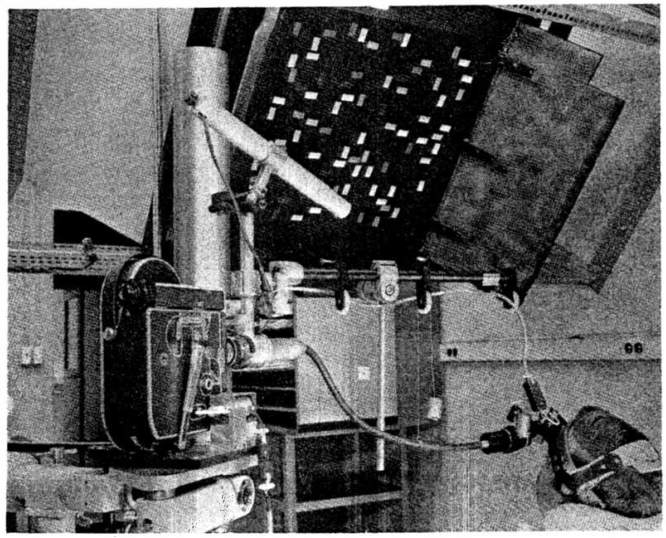

---

title       : The effect of target specification on objects fixated during visual search
subtitle    : A replication of L.G. Williams' 1967 study
author      : Ryan M. Hope
job         : CogWorks Lab
biglogo     : rpi_logo.png
logo        : cogworks_logo.png
framework   : io2012
highlighter : highlight.js
hitheme     : tomorrow
widgets     : []
mode        : selfcontained # {standalone, draft}
github      :
                author  : ryanhope
                repo    : issues_fall2012

---

## Motivation

> 1. ICCM 2010, Dave Kieras shows off improvements to Epic's visual system, uses Williams' search task for test model/data
> 2. CogWorks Lab got 2 awesome new high-speed eyetrackers
> 3. Inform work on lab grants:
>  - ONR Grant - Extreme Expertise in Cognitive Skill
>  - DARPA STTR SB12A-004 - Data Visualization

--- &vcenter

## Eyetracking 101


--- &twocol  w1:48% w2:48%

## Corneal Reflex Eyetracking

Purkinje images (reflections) are used in eye tracking technology to locate the orientation of the eye, by comparing the position of the first reflection of a known, fixed, infrared light source with the position of the pupil.

*** left

<video width="480" height="360" autoplay="autoplay" loop="loop">
  <source src="assets/video/raweye.mp4" type="video/mp4">
</video>

*** right


---

## What Williams found ~50 years ago

- When a person searches for a target in cluttered a visual field, fixations typically fall on objects
- When the search field contains object differing widely in size, color and shape:
 * A high proportion of fixations were on objects of specified color
 * A moderate proportion of fixations were on objects of specified size or shape
 * When two or more target characteristics are specified, fixations were generally based on a single characteristic

--- &twocol  w1:58% w2:38%

## MORE SAMPLES!

*** left



*** right

### Williams 1967:

- One sample every 4 seconds

### CogWorks Lab <2012:

- One sample every 16 miliseconds

### CogWorks Lab >=2012:

- One sample every 2 miliseconds

--- &twocol  w1:48% w2:48%

## Experimental Differences

*** left

### Williams 1967

- 5 shapes x 5 colors x 4 sizes
- 800 unique cue combinations
- 30 subjects
- 200 trials per subject
- ~1/6 trials not tabulated
- ~29% of tabulated fixations not classified
- <5000 good trials?
- search times approximated indirectly
- no temporal information


*** right

### CogWorks 2012

- 4 shapes x 4 colors x 3 sizes
- 384 unique cue combinations
- 16 subjects
- 384 trials per subject
- 3% trials dropped (>10% missing data)
- average .8% missing data per trial
- 5939 good trials

---

## Classifying Raw Gaze Samples

---

## The Williams' Search Task

### Between 1966 and 1968 L.G. Williams published a series of seminal journal articles and tech reports on visual search.

```{r include=FALSE}
source("~/workspace/WilliamsTask/williams.R")
```

--- &vcenter

## Classifying Raw Gaze Sample

```{r echo=FALSE, warning=FALSE, fig.width=13, fig.height=6.5, error=FALSE}
d=getData("~/williams-data/WilliamsSearch_2012-11-11_19-29-17_cbd946c2/trial-05.txt")
d.pva = pva(d$smi_sxl, d$smi_syl, d$adjusted_time, 500, 1680, 1050, 473.76, 296.1, d$smi_ezl, d$smi_exl, d$smi_eyl)
d.c <- classify.VA(as.data.frame(d.pva)$v, as.data.frame(d.pva)$a)
plot(d.pva, d.c) + theme(strip.text=element_text(face="bold", size=14),
                         legend.text=element_text(face="bold", size=14))

```

<div style="position:absolute; left:60px; bottom:28px; width:75%;">
Velocity Threshold = 30&deg;/s, Acceleration Threshold = 8000&deg;/s&sup2;
</div>

--- &vcenter

## Tabulating Fixations

```{r echo=FALSE, warning=FALSE, fig.width=13, fig.height=6.5, error=FALSE}
plot_trial("~/williams-data/WilliamsSearch_2012-11-11_19-29-17_cbd946c2", 5)
```

<div style="position:absolute; left:60px; bottom:28px; width:75%;">
Cue: Red, Crescent, Medium, 41
</div>

--- &vcenter

## Breakdowns: 1967 Study

```{r echo=FALSE, warning=FALSE, error=FALSE, results='asis'}
print(xtable(breakdown.w67()),type="html")
```

--- &vcenter

## Breakdowns: 2012 Study

```{r echo=FALSE, warning=FALSE, error=FALSE, results='asis'}
print(xtable(breakdown(read.table("~/williams-tabulated2-sup.dat",header=T))),type="html")
```

--- &vcenter

## Number of Fixations (ALL)

```{r echo=FALSE, warning=FALSE, fig.width=13, fig.height=6.5}
plot_nfix1(read.table("~/times.dat",header=T))
```

--- &vcenter

## Number of Fixations (OBJECTS)

```{r echo=FALSE, warning=FALSE, fig.width=13, fig.height=6.5}
plot_nfix2(read.table("~/times.dat",header=T))
```

--- &vcenter

## Number of Fixations (ALL Normalized?)

```{r echo=FALSE, warning=FALSE, fig.width=13, fig.height=6.5}
plot_avg_fix1(read.table("~/times.dat",header=T))
```

--- &vcenter

## Number of Fixations (OBJECTS Normalized?)

```{r echo=FALSE, warning=FALSE, fig.width=13, fig.height=6.5}
plot_avg_fix2(read.table("~/times.dat",header=T))
```

--- &vcenter

## Fixation Proportions (ALL)

```{r echo=FALSE, warning=FALSE, fig.width=13, fig.height=6.5}
plot_agg1(read.table("~/w67.combined2.dat",header=T))
```

--- &vcenter

## Fixation Proportions (OBJECTS)

```{r echo=FALSE, warning=FALSE, fig.width=13, fig.height=6.5}
plot_agg2(read.table("~/w67.combined2.dat",header=T))
```