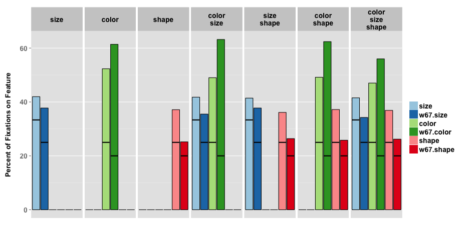

---

title       : The effect of target specification on objects fixated during visual search
subtitle    : A replication of L.G. Williams' 1967 study
author      : Ryan M. Hope
job         : CogWorks Lab
biglogo     : rpi_logo.png
logo        : cogworks_logo.png
framework   : io2012
highlighter : highlight.js
hitheme     : tomorrow
widgets     : []
mode        : selfcontained # {standalone, draft}
github      :
                author  : ryanhope
                repo    : issues_fall2012

---

## Motivation

> 1. ICCM 2010, Dave Kieras shows off improvements to Epic's visual system, uses Williams' search task for test model/data
> 2. CogWorks Lab got 2 awesome new high-speed eyetrackers
> 3. Inform work on lab grants:
>  - ONR Grant - Extreme Expertise in Cognitive Skill
>  - DARPA STTR SB12A-004 - Data Visualization

--- &vcenter

## Eyetracking 101

--- &twocol  w1:48% w2:48%

## Corneal Reflex Eyetracking

Purkinje images (reflections) are used in eye tracking technology to locate the orientation of the eye, by comparing the position of the first reflection of a known, fixed, infrared light source with the position of the pupil.

*** left

<video width="480" height="360" autoplay="autoplay" loop="loop">
  <source src="assets/video/raweye.mp4" type="video/mp4">
</video>

*** right

---

## What Williams found ~50 years ago

- When a person searches for a target in cluttered a visual field, fixations typically fall on objects
- When the search field contains object differing widely in size, color and shape:
 * A high proportion of fixations were on objects of specified color
 * A moderate proportion of fixations were on objects of specified size or shape
 * When two or more target characteristics are specified, fixations were generally based on a single characteristic

--- &twocol  w1:58% w2:38%

## MORE SAMPLES!

*** left

*** right

### Williams 1967:

- One sample every 4 seconds

### CogWorks Lab <2012:

- One sample every 16 miliseconds

### CogWorks Lab >=2012:

- One sample every 2 miliseconds

--- &twocol  w1:48% w2:48%

## Experimental Differences

*** left

### Williams 1967

- 5 shapes x 5 colors x 4 sizes
- 800 unique cue combinations
- 30 subjects
- 200 trials per subject
- ~1/6 trials not tabulated
- ~29% of tabulated fixations not classified
- <5000 good trials?
- search times approximated indirectly
- no temporal information

*** right

### CogWorks 2012

- 4 shapes x 4 colors x 3 sizes
- 384 unique cue combinations
- 16 subjects
- 384 trials per subject
- 3% trials dropped (>10% missing data)
- average .8% missing data per trial
- 5939 good trials

---

## Classifying Raw Gaze Samples

---

## The Williams' Search Task

### Between 1966 and 1968 L.G. Williams published a series of seminal journal articles and tech reports on visual search.

--- &vcenter

## Classifying Raw Gaze Sample

 

Velocity Threshold = 30&deg;/s, Acceleration Threshold = 8000&deg;/s&sup2;

--- &vcenter

## Tabulating Fixations

 

Cue: Red, Crescent, Medium, 41

--- &vcenter

## Breakdowns: 1967 Study

<!-- html table generated in R 2.15.2 by xtable 1.7-0 package -->
<!-- Tue Dec  4 20:41:54 2012 -->
<TABLE border=1>
<TR> <TH>  </TH> <TH> Bl </TH> <TH> Gr </TH> <TH> Ye </TH> <TH> Or </TH> <TH> Pi </TH> <TH> V </TH> <TH> L </TH> <TH> M </TH> <TH> S </TH> <TH> Ci </TH> <TH> Sc </TH> <TH> Tr </TH> <TH> Sq </TH> <TH> Cr </TH>  </TR>
  <TR> <TD align="right"> Color </TD> <TD> 0.61 </TD> <TD> 0.56 </TD> <TD> 0.59 </TD> <TD> 0.71 </TD> <TD> 0.6 </TD> <TD>  </TD> <TD>  </TD> <TD>  </TD> <TD>  </TD> <TD>  </TD> <TD>  </TD> <TD>  </TD> <TD>  </TD> <TD>  </TD> </TR>
  <TR> <TD align="right"> Size </TD> <TD>  </TD> <TD>  </TD> <TD>  </TD> <TD>  </TD> <TD>  </TD> <TD> 0.59 </TD> <TD> 0.29 </TD> <TD> 0.28 </TD> <TD> 0.35 </TD> <TD>  </TD> <TD>  </TD> <TD>  </TD> <TD>  </TD> <TD>  </TD> </TR>
  <TR> <TD align="right"> Shape </TD> <TD>  </TD> <TD>  </TD> <TD>  </TD> <TD>  </TD> <TD>  </TD> <TD>  </TD> <TD>  </TD> <TD>  </TD> <TD>  </TD> <TD> 0.26 </TD> <TD> 0.24 </TD> <TD> 0.24 </TD> <TD> 0.23 </TD> <TD> 0.29 </TD> </TR>
  <TR> <TD align="right"> Color + Size </TD> <TD> 0.59 </TD> <TD> 0.65 </TD> <TD> 0.67 </TD> <TD> 0.66 </TD> <TD> 0.59 </TD> <TD> 0.52 </TD> <TD> 0.3 </TD> <TD> 0.3 </TD> <TD> 0.3 </TD> <TD>  </TD> <TD>  </TD> <TD>  </TD> <TD>  </TD> <TD>  </TD> </TR>
  <TR> <TD align="right"> Color + Shape </TD> <TD> 0.64 </TD> <TD> 0.64 </TD> <TD> 0.66 </TD> <TD> 0.59 </TD> <TD> 0.59 </TD> <TD>  </TD> <TD>  </TD> <TD>  </TD> <TD>  </TD> <TD> 0.24 </TD> <TD> 0.26 </TD> <TD> 0.27 </TD> <TD> 0.24 </TD> <TD> 0.28 </TD> </TR>
  <TR> <TD align="right"> Size + Shape </TD> <TD>  </TD> <TD>  </TD> <TD>  </TD> <TD>  </TD> <TD>  </TD> <TD> 0.57 </TD> <TD> 0.3 </TD> <TD> 0.29 </TD> <TD> 0.35 </TD> <TD> 0.27 </TD> <TD> 0.25 </TD> <TD> 0.26 </TD> <TD> 0.24 </TD> <TD> 0.3 </TD> </TR>
  <TR> <TD align="right"> Color + Size + Shape </TD> <TD> 0.54 </TD> <TD> 0.55 </TD> <TD> 0.55 </TD> <TD> 0.62 </TD> <TD> 0.54 </TD> <TD> 0.49 </TD> <TD> 0.31 </TD> <TD> 0.29 </TD> <TD> 0.28 </TD> <TD> 0.26 </TD> <TD> 0.28 </TD> <TD> 0.25 </TD> <TD> 0.26 </TD> <TD> 0.26 </TD> </TR>
   </TABLE>

--- &vcenter

## Breakdowns: 2012 Study

<!-- html table generated in R 2.15.2 by xtable 1.7-0 package -->
<!-- Tue Dec  4 20:41:56 2012 -->
<TABLE border=1>
<TR> <TH>  </TH> <TH> Bl </TH> <TH> Gr </TH> <TH> Re </TH> <TH> Ye </TH> <TH> L </TH> <TH> M </TH> <TH> S </TH> <TH> Cc </TH> <TH> Cx </TH> <TH> Ov </TH> <TH> St </TH>  </TR>
  <TR> <TD align="right"> Color </TD> <TD> 0.51 </TD> <TD> 0.51 </TD> <TD> 0.52 </TD> <TD> 0.55 </TD> <TD>  </TD> <TD>  </TD> <TD>  </TD> <TD>  </TD> <TD>  </TD> <TD>  </TD> <TD>  </TD> </TR>
  <TR> <TD align="right"> Size </TD> <TD>  </TD> <TD>  </TD> <TD>  </TD> <TD>  </TD> <TD> 0.67 </TD> <TD> 0.36 </TD> <TD> 0.23 </TD> <TD>  </TD> <TD>  </TD> <TD>  </TD> <TD>  </TD> </TR>
  <TR> <TD align="right"> Shape </TD> <TD>  </TD> <TD>  </TD> <TD>  </TD> <TD>  </TD> <TD>  </TD> <TD>  </TD> <TD>  </TD> <TD> 0.39 </TD> <TD> 0.37 </TD> <TD> 0.38 </TD> <TD> 0.34 </TD> </TR>
  <TR> <TD align="right"> Color + Size </TD> <TD> 0.50 </TD> <TD> 0.51 </TD> <TD> 0.47 </TD> <TD> 0.48 </TD> <TD> 0.67 </TD> <TD> 0.37 </TD> <TD> 0.22 </TD> <TD>  </TD> <TD>  </TD> <TD>  </TD> <TD>  </TD> </TR>
  <TR> <TD align="right"> Color + Shape </TD> <TD> 0.49 </TD> <TD> 0.47 </TD> <TD> 0.53 </TD> <TD> 0.48 </TD> <TD>  </TD> <TD>  </TD> <TD>  </TD> <TD> 0.39 </TD> <TD> 0.36 </TD> <TD> 0.39 </TD> <TD> 0.35 </TD> </TR>
  <TR> <TD align="right"> Size + Shape </TD> <TD>  </TD> <TD>  </TD> <TD>  </TD> <TD>  </TD> <TD> 0.66 </TD> <TD> 0.38 </TD> <TD> 0.20 </TD> <TD> 0.36 </TD> <TD> 0.38 </TD> <TD> 0.37 </TD> <TD> 0.33 </TD> </TR>
  <TR> <TD align="right"> Color + Size + Shape </TD> <TD> 0.49 </TD> <TD> 0.47 </TD> <TD> 0.44 </TD> <TD> 0.48 </TD> <TD> 0.66 </TD> <TD> 0.39 </TD> <TD> 0.20 </TD> <TD> 0.39 </TD> <TD> 0.36 </TD> <TD> 0.39 </TD> <TD> 0.34 </TD> </TR>
   </TABLE>

--- &vcenter

## Number of Fixations (ALL)

 

--- &vcenter

## Number of Fixations (OBJECTS)

 

--- &vcenter

## Number of Fixations (ALL Normalized?)

 

--- &vcenter

## Number of Fixations (OBJECTS Normalized?)

 

--- &vcenter

## Fixation Proportions (ALL)

 

--- &vcenter

## Fixation Proportions (OBJECTS)

 

