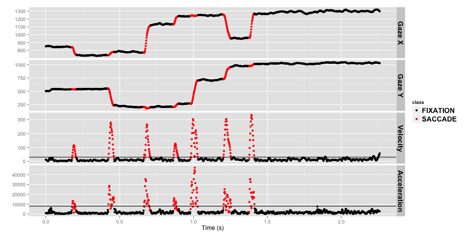
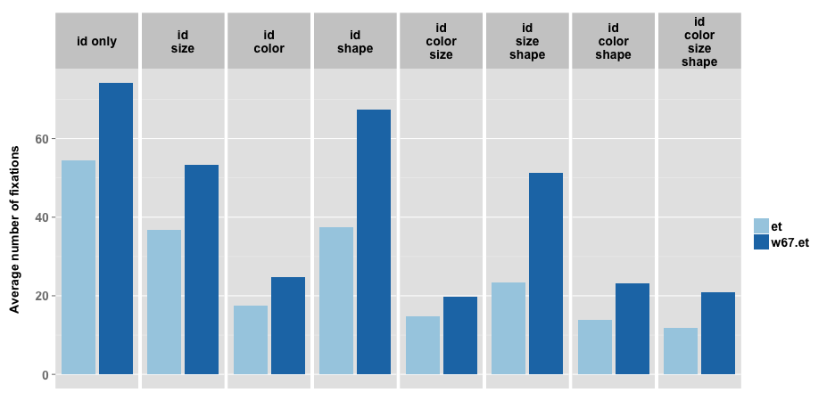

---

title       : The effect of target specification on objects fixated during visual search
subtitle    : A replication of L.G. Williams' 1967 study
author      : Ryan M. Hope
job         : CogWorks Lab
biglogo     : rpi_logo.png
logo        : cogworks_logo.png
framework   : io2012
highlighter : highlight.js
hitheme     : tomorrow
widgets     : []
mode        : selfcontained # {standalone, draft}
github      :
                author  : ryanhope
                repo    : issues_fall2012

--- &twocol  w1:48% w2:48%

## The Williams' Search Task

*** left

*** right

 

---

## Motivation

> 1. ICCM 2010, Dave Kieras shows off improvements to Epic's visual system, uses Williams' search task for test model/data
> 2. CogWorks Lab got 2 awesome new high-speed eyetrackers
> 3. Inform work on lab grants:
>  - ONR Grant - Extreme Expertise in Cognitive Skill
>  - DARPA STTR SB12A-004 - Data Visualization

---

## Why the Williams' 1967 study needs replicating

> 1. Eyetracking technology has improved greatly
> 1. Computer algorithms for analyzing eyetracker data
> 1. Other methodological concerns

--- &twocol  w1:48% w2:48%

## Corneal Reflex Eye tracking

Purkinje images (reflections) are used in eye tracking technology to locate the orientation of the eye, by comparing the position of the first reflection of a known, fixed, infrared light source with the position of the pupil.

*** left

<video width="480" height="360" autoplay="autoplay" loop="loop">
  <source src="assets/video/raweye.mp4" type="video/mp4">
</video>

*** right

--- &twocol  w1:58% w2:38%

## The Williams' 1967 setup

*** left

*** right

- 1 image every 4 seconds
- each 4 second image contains multiple fixations
- left eye mostly occluded
- no temporal information
- ~1/6 trials not tabulated
- ~29% of tabulated fixations not classified
- search times approximated indirectly

--- &twocol  w1:58% w2:38%

## The CogWorks 2012 setup

*** left

*** right

- 1 sample every 2 milliseconds
- 3% trials dropped (>10% missing data)
- average 0.8% missing data per trial

--- &vcenter

## Classifying Raw Gaze Sample

 

Velocity Threshold = 30&deg;/s, Acceleration Threshold = 8000&deg;/s&sup2;

--- &vcenter

## Tabulating Fixations

 

Cue: Red, Crescent, Medium, 41

--- &twocol  w1:48% w2:48%

## Other experimental differences

*** left

### Williams 1967

- 5 shapes x 5 colors x 4 sizes
- shapes: semi circle, circle, triangle, cross, square
- sizes: 2.8, 1.9, 1.3, 0.8
- 800 unique cue combinations
- 30 subjects
- 200 trials per subject
- <5000 good trials?

*** right

### CogWorks 2012

- 4 shapes x 4 colors x 3 sizes
- shapes: crescent, star, cross, oval
- sizes: 1.87, 1.11, .44
- 384 unique cue combinations
- 16 subjects
- 384 trials per subject
- 5939 good trials
- randomized cue order

--- &vcenter

## Breakdowns: 1967 Study

Proportions of fixations (for fixations that landed on objects)

<!-- html table generated in R 2.15.2 by xtable 1.7-0 package -->
<!-- Wed Dec  5 11:27:42 2012 -->
<TABLE border=1>
<TR> <TH>  </TH> <TH> Bl </TH> <TH> Gr </TH> <TH> Ye </TH> <TH> Or </TH> <TH> Pi </TH> <TH> V </TH> <TH> L </TH> <TH> M </TH> <TH> S </TH> <TH> Ci </TH> <TH> Sc </TH> <TH> Tr </TH> <TH> Sq </TH> <TH> Cr </TH>  </TR>
  <TR> <TD align="right"> Color </TD> <TD> 0.61 </TD> <TD> 0.56 </TD> <TD> 0.59 </TD> <TD> 0.71 </TD> <TD> 0.6 </TD> <TD>  </TD> <TD>  </TD> <TD>  </TD> <TD>  </TD> <TD>  </TD> <TD>  </TD> <TD>  </TD> <TD>  </TD> <TD>  </TD> </TR>
  <TR> <TD align="right"> Size </TD> <TD>  </TD> <TD>  </TD> <TD>  </TD> <TD>  </TD> <TD>  </TD> <TD> 0.59 </TD> <TD> 0.29 </TD> <TD> 0.28 </TD> <TD> 0.35 </TD> <TD>  </TD> <TD>  </TD> <TD>  </TD> <TD>  </TD> <TD>  </TD> </TR>
  <TR> <TD align="right"> Shape </TD> <TD>  </TD> <TD>  </TD> <TD>  </TD> <TD>  </TD> <TD>  </TD> <TD>  </TD> <TD>  </TD> <TD>  </TD> <TD>  </TD> <TD> 0.26 </TD> <TD> 0.24 </TD> <TD> 0.24 </TD> <TD> 0.23 </TD> <TD> 0.29 </TD> </TR>
  <TR> <TD align="right"> Color + Size </TD> <TD> 0.59 </TD> <TD> 0.65 </TD> <TD> 0.67 </TD> <TD> 0.66 </TD> <TD> 0.59 </TD> <TD> 0.52 </TD> <TD> 0.3 </TD> <TD> 0.3 </TD> <TD> 0.3 </TD> <TD>  </TD> <TD>  </TD> <TD>  </TD> <TD>  </TD> <TD>  </TD> </TR>
  <TR> <TD align="right"> Color + Shape </TD> <TD> 0.64 </TD> <TD> 0.64 </TD> <TD> 0.66 </TD> <TD> 0.59 </TD> <TD> 0.59 </TD> <TD>  </TD> <TD>  </TD> <TD>  </TD> <TD>  </TD> <TD> 0.24 </TD> <TD> 0.26 </TD> <TD> 0.27 </TD> <TD> 0.24 </TD> <TD> 0.28 </TD> </TR>
  <TR> <TD align="right"> Size + Shape </TD> <TD>  </TD> <TD>  </TD> <TD>  </TD> <TD>  </TD> <TD>  </TD> <TD> 0.57 </TD> <TD> 0.3 </TD> <TD> 0.29 </TD> <TD> 0.35 </TD> <TD> 0.27 </TD> <TD> 0.25 </TD> <TD> 0.26 </TD> <TD> 0.24 </TD> <TD> 0.3 </TD> </TR>
  <TR> <TD align="right"> Color + Size + Shape </TD> <TD> 0.54 </TD> <TD> 0.55 </TD> <TD> 0.55 </TD> <TD> 0.62 </TD> <TD> 0.54 </TD> <TD> 0.49 </TD> <TD> 0.31 </TD> <TD> 0.29 </TD> <TD> 0.28 </TD> <TD> 0.26 </TD> <TD> 0.28 </TD> <TD> 0.25 </TD> <TD> 0.26 </TD> <TD> 0.26 </TD> </TR>
   </TABLE>

--- &vcenter

## Breakdowns: 2012 Study

Proportions of fixations (for fixations that landed on objects)

<!-- html table generated in R 2.15.2 by xtable 1.7-0 package -->
<!-- Wed Dec  5 11:27:43 2012 -->
<TABLE border=1>
<TR> <TH>  </TH> <TH> Bl </TH> <TH> Gr </TH> <TH> Re </TH> <TH> Ye </TH> <TH> L </TH> <TH> M </TH> <TH> S </TH> <TH> Cc </TH> <TH> Cx </TH> <TH> Ov </TH> <TH> St </TH>  </TR>
  <TR> <TD align="right"> Color </TD> <TD> 0.51 </TD> <TD> 0.51 </TD> <TD> 0.52 </TD> <TD> 0.55 </TD> <TD>  </TD> <TD>  </TD> <TD>  </TD> <TD>  </TD> <TD>  </TD> <TD>  </TD> <TD>  </TD> </TR>
  <TR> <TD align="right"> Size </TD> <TD>  </TD> <TD>  </TD> <TD>  </TD> <TD>  </TD> <TD> 0.67 </TD> <TD> 0.36 </TD> <TD> 0.23 </TD> <TD>  </TD> <TD>  </TD> <TD>  </TD> <TD>  </TD> </TR>
  <TR> <TD align="right"> Shape </TD> <TD>  </TD> <TD>  </TD> <TD>  </TD> <TD>  </TD> <TD>  </TD> <TD>  </TD> <TD>  </TD> <TD> 0.39 </TD> <TD> 0.37 </TD> <TD> 0.38 </TD> <TD> 0.34 </TD> </TR>
  <TR> <TD align="right"> Color + Size </TD> <TD> 0.50 </TD> <TD> 0.51 </TD> <TD> 0.47 </TD> <TD> 0.48 </TD> <TD> 0.67 </TD> <TD> 0.37 </TD> <TD> 0.22 </TD> <TD>  </TD> <TD>  </TD> <TD>  </TD> <TD>  </TD> </TR>
  <TR> <TD align="right"> Color + Shape </TD> <TD> 0.49 </TD> <TD> 0.47 </TD> <TD> 0.53 </TD> <TD> 0.48 </TD> <TD>  </TD> <TD>  </TD> <TD>  </TD> <TD> 0.39 </TD> <TD> 0.36 </TD> <TD> 0.39 </TD> <TD> 0.35 </TD> </TR>
  <TR> <TD align="right"> Size + Shape </TD> <TD>  </TD> <TD>  </TD> <TD>  </TD> <TD>  </TD> <TD> 0.66 </TD> <TD> 0.38 </TD> <TD> 0.20 </TD> <TD> 0.36 </TD> <TD> 0.38 </TD> <TD> 0.37 </TD> <TD> 0.33 </TD> </TR>
  <TR> <TD align="right"> Color + Size + Shape </TD> <TD> 0.49 </TD> <TD> 0.47 </TD> <TD> 0.44 </TD> <TD> 0.48 </TD> <TD> 0.66 </TD> <TD> 0.39 </TD> <TD> 0.20 </TD> <TD> 0.39 </TD> <TD> 0.36 </TD> <TD> 0.39 </TD> <TD> 0.34 </TD> </TR>
   </TABLE>

--- &vcenter

## Fixation Proportions

 

--- &vcenter

## Number of Fixations

 

--- &vcenter

## Fixations / Number of Objects

 

--- &vcenter

## Refixations

 

--- &vcenter

## Backtracking

 

Cue: Cross, 05

--- &twocol  w1:48% w2:48%

## Fixation Durations

*** left

 

*** right

 

Error bars are 95% confidence intervals

---

## What Williams found ~50 years ago

- When a person searches for a target in cluttered a visual field, fixations typically fall on objects
- When the search field contains object differing widely in size, color and shape:
 * A high proportion of fixations were on objects of specified color
 * A moderate proportion of fixations were on objects of specified size or shape
 * When two or more target characteristics are specified, fixations were generally based on a single characteristic

---

## What is new in 2012 (so far)

- Size can be a better cue than color
- Refixations are highly prevalent when cue is not useful
- Not all visual processing happens during fixations
 - implications for cognitive architectures

--- &vcenter

## Application: Data Visualization

---

## Whats to come?

- Collect data from more subjects in Q1 2013
- Analyze in more detail "backtracking"
- Investigate curved saccades **
- Test Williams' search time predictions
- ACT-R model

---

## References

- Dodge, R., & Cline, T. (1901). The angle velocity of eye movements. Psychological Review.
- Williams, L. G. (1966). A study of visual search using eye movement recordings.
- Williams, L. G. (1967). The effects of target specification on objects fixated during visual search. Acta Psychologica, 27(00), 355–360.
- Williams, L. G. (1968). A study of visual search using eye movement recordings: Validation Studies.
- Kieras, D. (2010). Modeling Visual Search of Displays of Many Objects : The Role of Differential Acuity and Fixation Memory. In D. D. Salvucci & G. Gunzelmann (Eds.), Proceedings of the 10th international conference on cognitive modeling. Philadelphia, PA: Drexel University.
- Nyström, M., & Holmqvist, K. (2010). An adaptive algorithm for fixation, saccade, and glissade detection in eyetracking data. Behavior Research Methods.
